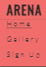
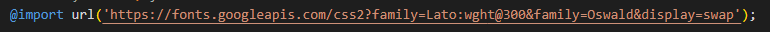
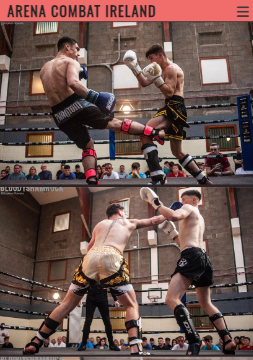
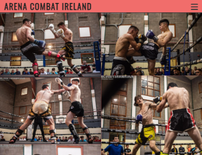

# Arena Combat Ireland

Arena Combat is a website to promote one of Irelands newest amateur kick-boxing promotions.
It's goal is to connect Ireland's highlest level competing kick-boxing athletes throughout the country.
The page is designed to appeal to both k1 and muay-thai competing athletes . The web page features a gallery section from previous Arena events and also a sign up section, for athletes who would like to compete in uncoming events.

# Table Of Contents 
1. User Experience 
2. Features 
3. Testing 
4. Deployment
5. Credits 
6. Contact

# 1. User Experience
## Visitor Goals 

### The target audience for Arena Combat Ireland are:
- People who would like to participate in an event.
- Coaches who would like to sign up their own competitors.
- People who want to see photos from the events.
- People who want to learn about kick-boxing in Ireland.

### The user goals of this page are :
- To learn the different rule-sets Arena offers.
- To know when the upcoming events take place.
- To see photos from previous events in the gallery section.
- To sign up to compete. 

### Arena Combat Ireland helps acheive these goals by :
- Including an information section.
- Including a gallery section which shows photos from previous events.
- Provide socia media links to follow the promotion.
- Includes a section where coaches or competitors can sign up.

### User Stories:

1. If I have previously competed, I expect to see photos from my bout.
2. If I would like to find out information, I would expect to be able to gain info from the about section.
3. If I am a coach, I would expect to be able to sign up my competitors for the next promotion.
4. If I am a competitor, I would expect to be able to sign up to take part in the next event.
4. As someone who is inerested in the event, I expect to find their social media links.
5. If I want to go as a viewer, I expect to find out information about the next event.

## Visual Design

### Wireframes:

#### Sketching:

I started to create mock ups of my website by hand. I experimented with different designs on a desk-top computer and a mobile phone.

 

#### Balsamiq
After creating mock-ups by hand I used Balsamiq to create more wireframes. I started to play around with different images as the hero image.

 

 ## Colours
 
 I used 3 main colors in this project. White, black and red rgba(241, 109, 109). I changed the background colour from a lighter tone(#3a3a3a) to black(##000000) in the later stages of the development. I found this created much more contrast within the different sections than the previous lighter shade of black.

## Fonts

The primary font that i used throughout this website was Oswald. This is because the font is captivating and it catches the viewers attention, which is one of the main goals of the website.

I also used the Lato font in some parts of the page, for example, in the menu section Lato was used to represent different pages in the website. This is because it is not essential information for the viewer. Therefore the lesser captivating font, Lato was used.

## Icons:

The icons that were used in this project  were taken from wwww.fontawesome.com.The icons are located in the footer and they provide links to social media platoforms.

## Images

The site relies heavily on images. The home page includes three images. The hero image is striking and captures the attention of the viewer. The second image is found in the rules section. It is a small circluar image. The third image is used as a background image on the bottom of the page. 

The gallery section contains several images of competitors in action. The photos are set to fill the length of the page.
There is also a captivating background image used in the sign-up page.

# Features :

 ## Navbar: 

 The nav bar has been designed very simply. On a mobile it will will feature a drop down menu as shwon below. It includes a hamburger icon which enhances the user experience. Here is the code I used.  On a desk top this dropdown feature will dissapear and the navbar will display the three pages of the website.

 
 

 ## Footer:
 
 The footer has been designed very simply. It includes external links to social media platforms such as Facebook, Twitter, Instagram and Youtube.
 
 

 ## Form:
 
 The form feature was used for the last page of the website. A radio-button and a select box feature was also added to give variety to the section. Here is some of the code I used :

# Testing
 
## Mobile Testing :
 
 - I constantly checked how the site functioned on my Iphone throughout the project. 
 - I sent my friends the website and listened to their feedback
 - I also frequently used google chrome to inspect how the site functioned on different mobile screens.
 - I also used the lighthouse feature on chrome frequently and ensured it scored high overall.

 ## Desktop Testing :
 
 - As I completed this project on a laptop, I frequently opened the preview to see how the site functioned.
 - I also asked relatives to open a preview on their desktops to examine how it looked.
 - I also used the lighthouse feature on chrome to see how my website looked on the browser.

 # Validation :
 
 - HTML checked with W3C HTML5 Validator and I ensured there was no errors in my code.
 - CSS checked with W3C CSS Validator and I ensured there was no errors in my code.

 # Credits :
 

 For this project, I took a lot of inspiration from the Love Running walkthrough project. I incorporated the general structure of the Love running website into my own. For example, I included a home page, a gallery page, and a sign-up page. 

For the competition dates section, I used a similar design to that of the Love Running meet up times section.

For my project. I customised the code to make the divs appear in a different way to the love running project on different screen sizes. I also used my own image and text. Below, you can see how I used media queries to make the content appear different on 3 different screen sizes.

 I also took inspiration from the Love Running sign-up pages 

 
For my own sign up page. I used a form element with different inputs like a select box and a radiobutton. I also used my own image as the background. I added a transperant red color as the background color for the sign-up box to create contarst on the page. 

 Deployment Instructions
 -
 1. Click the link https://github.com/ruairikeane11/project1-arena.git.

2. When you can see web page, click on the settings button on the top.

3. Gitub pages will update from the master branch by default.
 
4. On the left hand side of the page there will be a menu. Click on the pages section.

5. A link to the website should be now visible on the top of the page.

