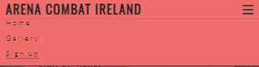
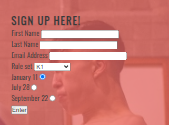
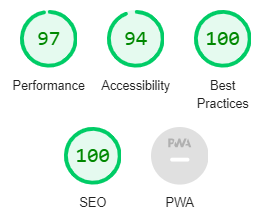
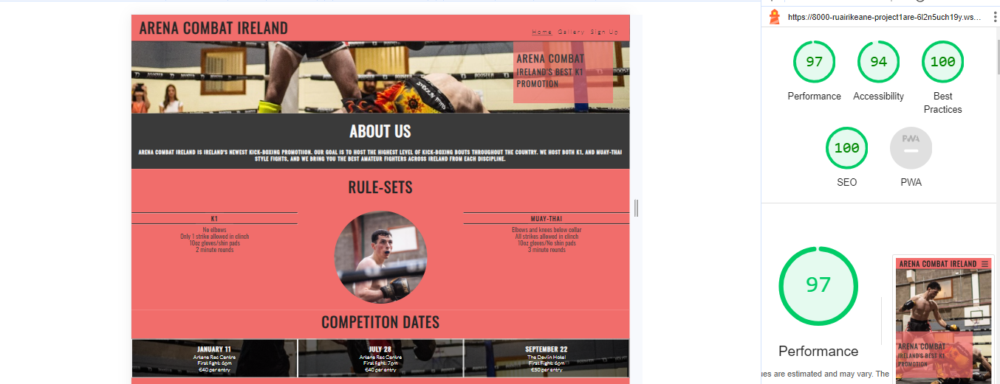
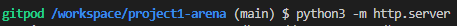

# Project 1 - Arena Combat Ireland
###### Arena Combat is a website to promote one of Irelands newest amateur kick-boxing promotions. It's goal is to connect Ireland's highlest level competing kick-boxing athletes throughout the country. The page is designed for both k1 and muay-thai competing athletes. The web page features a gallery section from previous Arena events and also a sign up section, for athletes who would like to compete in upcoming events.

# Table Of Contents 
1. User Experience
2. Features
3. Testing
4. Deployment
5. Credits 
6. Contact

# 1. User Experience
## Visitor Goals
### The target audience for Arena Combat Ireland are:
- People who would like to participate in an event.
- Coaches who would like to sign up their own competitors.
- People who want to see photos from the previous events.
- People who want to learn about kick-boxing in Ireland.

### The user goals of this page are:
- To learn the different rule-sets arena offers.
- To see when/where the upcoming events take place.
- To see photos from previous events.
- To sign up to compete.

### Arena Combat Ireland helps acheive these goals by:
- Including an 'About us' section.
- Including a gallery section which shows photos from previous events.
- Provide socia media links to follow the promotion.
- Includes a section where coaches or competitors can sign up.
- Includes where/when upcoming events take place.

### User Stories:
1. If I have previously competed, I expect to see photos from my bout.
2. If I would like to find out information.
3. If I am a coach/competitor, I would expect to be able to sign up my competitors.
4. As someone who is inerested in the event, I expect to find their social media links in the footer section.
5. If I want to go as a viewer, I expect to find out information about the next events.

## Visual Design

### Wireframes 
#### Sketching 
I started creating mock-ups of my intended website design by hand. I experimented with different designs and layouts on desk-tops and mobiles.

##### Mobile Design

##### Desk-top Design

#### Balsamiq 
After creating mock-ups by hand I used Balsamiq to create more wireframes. I started to play around with different images as the hero image.

 

## Colours
I used 3 main colors in this project. White(#FAFAFA), black(#3A3A3A) and red rgba(241, 109, 109). I found the contrast of these 3 colours captivating, ultimately fitting with the overall theme of combat sports.

## Fonts

### Oswald
The primary font that i used throughout this website was Oswald. This is because the font is captivating and it catches the viewers attention, which is one of the main goals of the website.

### Lato 
I also used the Lato font in some parts of the page, for example, in the menu section Lato was used to represent different pages in the website. This is because it is not essential information for the viewer. Therefore the lesser captivating font, Lato, was used. Both font styles were imported from Google Fonts.

## Icons:
The icons that were used in this project  were taken from (https://fontawesome.com) The icons are located in the footer and they provide links to social media platoforms.

## Images:
### Home Page: 
The site includes many images. The home page includes three images. The hero image is striking and captures the attention of the viewer. The second image is found in the rules section. It is a small circluar image. The third image is used as a background image on the bottom of the page. 

###  Gallery Section :
The gallery section contains several images. The page is responsive and the column-count of photographs will increase as the viewing screen size increases also.

  

### Sign Up Section :
There is also a background image used in the sign-up page.

# 2. Features 
## Navbar
The nav bar has been designed very simply. On a mobile it will will feature a burger icon menu as shown below.On a desk top this dropdown feature will dissapear and the navbar will display the three pages of the website.

## Footer:
The footer has been designed very simply. It includes external links to social media platforms such as Facebook, Twitter, Instagram and Youtube.

 
## Form
A form feature was used for the last page of the website. A radio-button and a select box feature was also added to give variety to the section.

# 3. Testing
## Mobile Testing
- I constantly checked how the site functioned on my Iphone throughout the project.
- I frequently sent the website to friends and was welcome to criticism.
- I also used the lighthouse feature on chrome frequently to see how my work looks on mobile devices.
- I ensured that my website scored high in Lighthouse.

## Desktop Testing :
- As I completed this project on a laptop, I frequently opened the preview to see how the site functioned.
- I also asked relatives to open a preview on their desktops to examine how it looked.
- I tested the website in multiple browsers.
- I also used the lighthouse feature on chrome to see how my website looked on the browser.
- All features were tested manually, for example, the form will not submit without providing valid information.

## Testing User Stories 
- As a previous competitor, I can go to the gallery, so that I can find photos from my bout.
- As a website user, I can read the 'About us' section, so that I can get more information.
- As a coach/competitor, I can go to the sign up page, so that I can enroll in the next event.
- As someone who is interested, I can go to the footer, so that I can follow the links to social media.
- As a viewer, I can go to the bottom of the home page, so that I can find out about the time/location of upcoming events.

## Validation :
 - HTML checked with W3C HTML5 Validator until there was no errors.
 - CSS checked with W3C CSS Validator until there was no errors.

# 4. Credits :
## Love Running Walkthrough Project
For this project, I took a lot of inspiration from the Love Running walkthrough project. I incorporated the general structure of the Love running website into my own. For example, I included a home page, a gallery page, and a sign-up page. I customised my website to fit my intended design while keeping the same general structure as the Love Running Project, as I thought it worked well with the features I wanted to include.

## Mentor Tutor Sessions - Rory Sheridan
I found my three meetings with my mentor tutor very helpful in the completion of this project. In each session I received feedback on my work, and Rory was able to assist me in terms of time managment and efficiency.

# 5. Deployment Instructions
## Local
1. Copy the repository here - (https://github.com/ruairikeane11/project1-arena.git)
2. Open your IDE. I used Gitpod (https://gitpod.io/workspaces)

3. Paste the copied repositry into the workspace bar.

4. Click continue, and the repository should open.

5. Once the repository is open in your IDE, type 'python3 -m http.server' into the teminal.

6. Click 'Open Browser'. You should now be able to see that the website is displaying in the browser.

## Github Deployment
1. Make sure to have an account before using Github.

2. Copy the link to the repository (https://github.com/ruairikeane11/project1-arena)

3. Once here, click the 'Settings' tab.

4. Select 'Pages' on the left hand side of the page.

5. Select the 'Master Branch' as the source and 'Confirm' your selection.

6. After a few minutes, a link to the live website should show at the top of the page.

# 6. Contact
Please contact at ruairi.rk@icloud.com.

